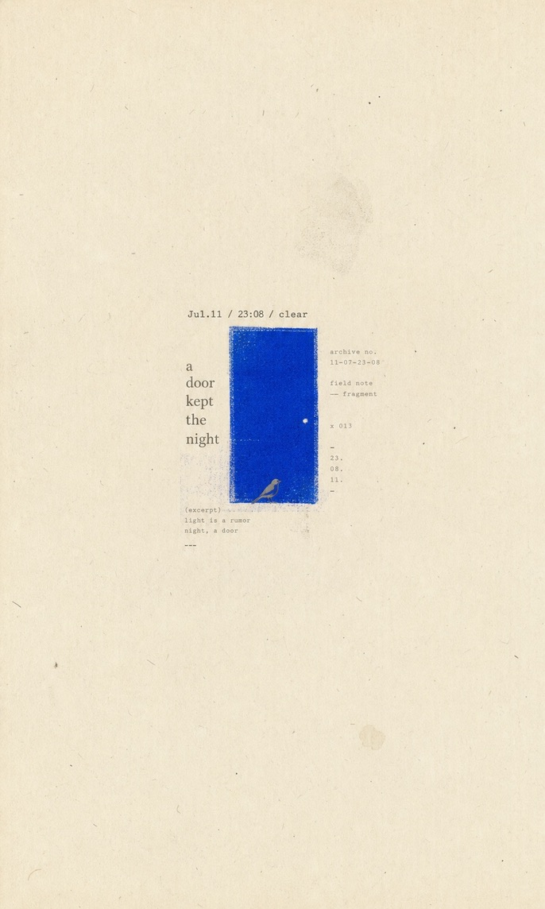
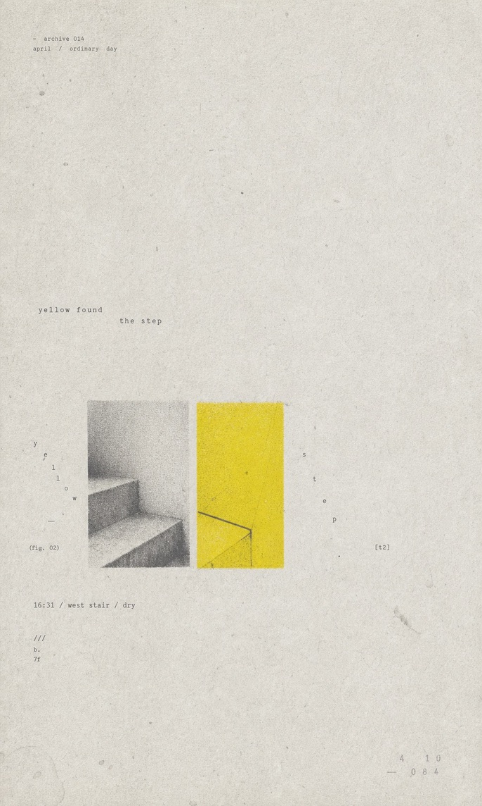
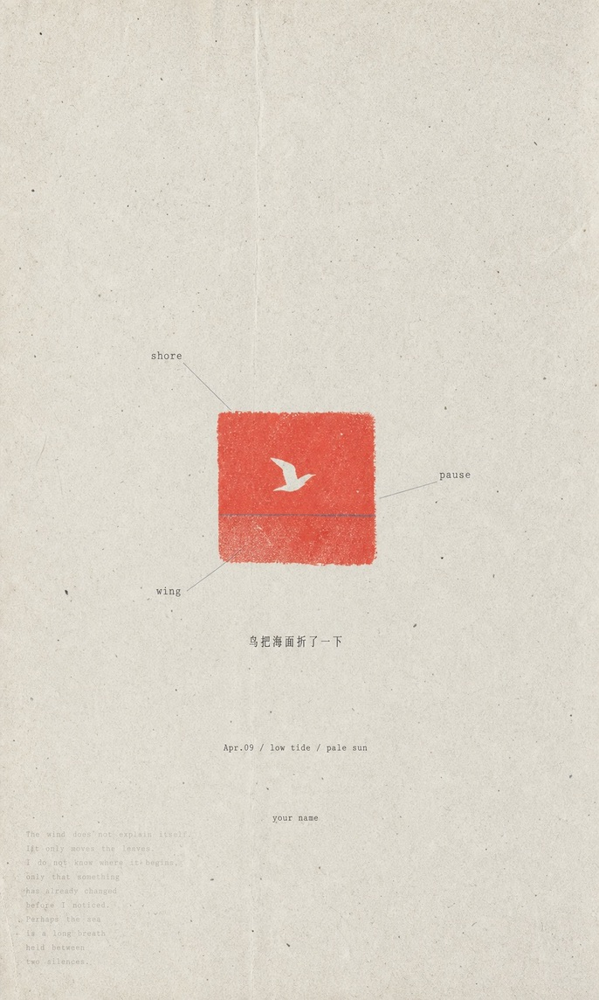
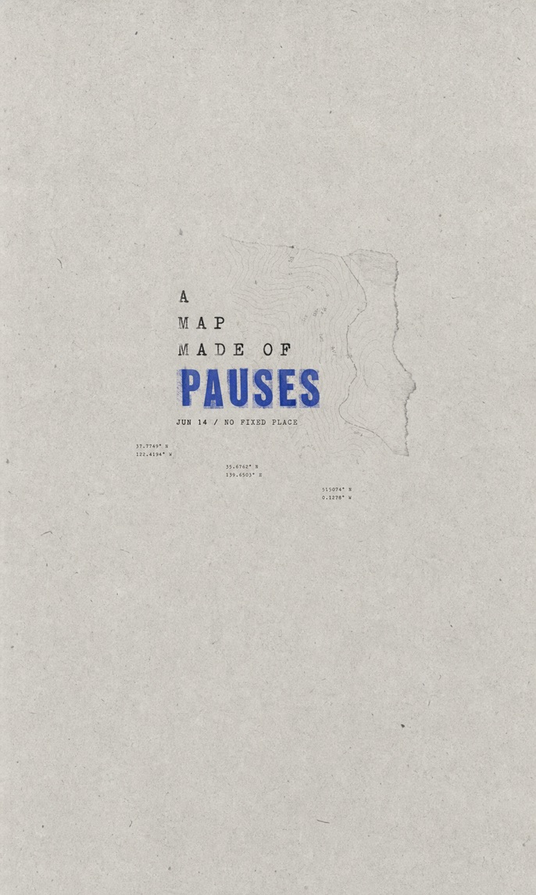
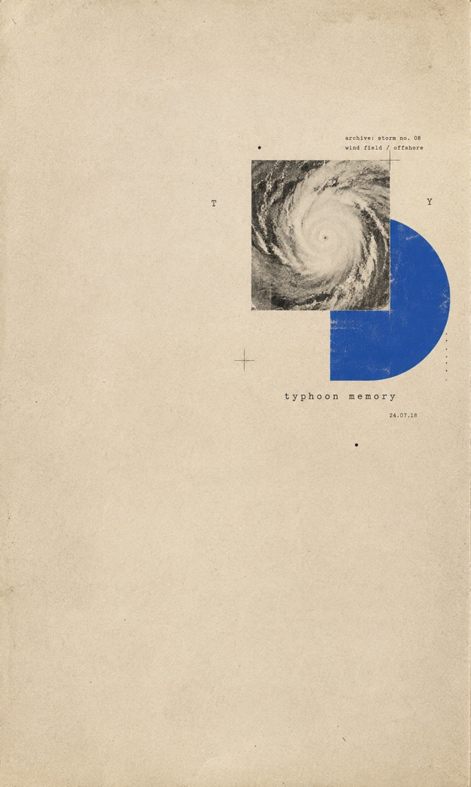

# GC Minimal Zine Poster

A Codex skill for turning a theme, sentence, object, mood, article idea, photo, or content brief into a quiet minimal zine-style editorial poster prompt and a generated raster image.

The callable skill name is `gc-minimal-zine-poster-v0-1`.

## Visual Direction

The skill compiles each request into a sparse vertical paper poster with:

- a 3:5 aged-paper canvas
- 70%-90% negative space
- one small imageable subject or visual cluster
- serif, typewriter, or monospaced typography
- one clearly visible high-chroma color anchor
- xerox, risograph, halftone, letterpress, or scanned-paper defects
- a quiet Japanese/Korean indie-zine or minimal editorial mood

It avoids commercial advertising layouts, glossy mockups, cinematic lighting, 3D rendering, neon, dense scrapbooks, and long clean text blocks.

## Examples

| Night Door | Yellow Step |
| --- | --- |
|  |  |

| Shore Pause | Pause Map |
| --- | --- |
|  |  |

| Typhoon Memory | Moon Tide |
| --- | --- |
|  |  |

## Installation

Clone the public repository directly into the Codex skills directory:

```bash
git clone https://github.com/LiamGvchi/gc-minimal-zine-poster.git \
  ~/.codex/skills/gc-minimal-zine-poster-v0-1
```

Restart Codex if the skill does not appear immediately.

## Usage

Invoke the skill by name and provide a theme or brief:

```text
用 $gc-minimal-zine-poster-v0-1 做一张关于雨天旧书店的海报
```

You can also provide a sentence, article idea, object, mood, or reference image.

## Output

For every generation request, the skill returns:

1. the generated raster poster image
2. the final image-generation prompt
3. the selected variation recipe and a short interpretation note

The workflow uses Standard Mode and generates the image by default. It only stops at prompt-only output when the user explicitly asks for that.

## Repository Structure

- `SKILL.md`: the complete Codex skill instructions
- `README.md`: public overview and installation instructions
- `LICENSE`: MIT license
- `examples/`: selected generated posters

This repository publishes one standalone skill. A separate private vault may aggregate backups of multiple local skills, but private backup automation and unrelated skills are intentionally excluded here.

## License

MIT. See `LICENSE`.
