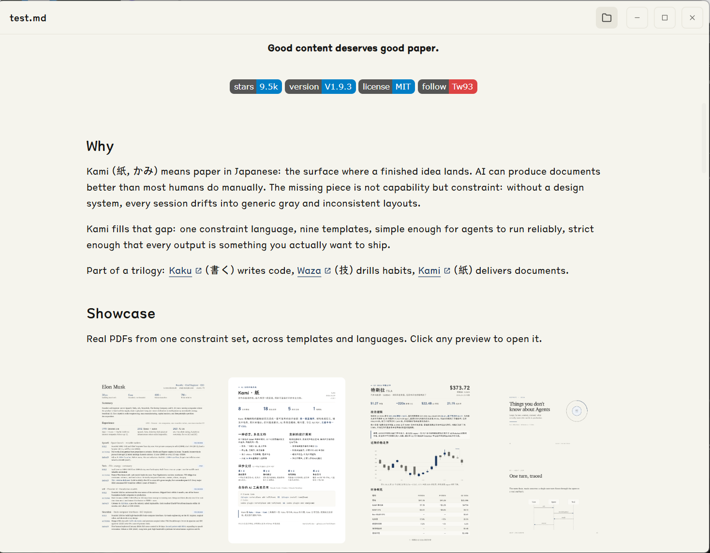

# Kami Markdown Viewer

_A read-only Markdown viewer for Windows, crafted with Kami's warm document aesthetic._

## Download

The easiest way to get started is to download the latest installer from [GitHub Releases](https://github.com/HwFee/kami-markdown-viewer/releases).

Two Windows installer formats are provided:

- **MSI** — `Kami Markdown Viewer_0.1.0_x64_en-US.msi`  
  Recommended for system-wide or managed installs.
- **NSIS Setup** — `Kami Markdown Viewer_0.1.0_x64-setup.exe`  
  Recommended for a lightweight per-user install.

Both installers automatically register `.md` and `.markdown` file associations, so you can open Markdown files directly from File Explorer.

> **Platform note:** Kami Markdown Viewer is currently built and tested for **Windows 10/11 x64** only.

## Features

- **Read-first experience.** No editing chrome, no split panes — just the document.
- **Kami-inspired design.** Warm parchment background (`#f5f4ed`), serif typography, and a single navy accent.
- **GitHub Flavored Markdown.** Tables, task lists, blockquotes, fenced code blocks, and inline formatting.
- **Syntax highlighting.** Code blocks are rendered with `react-syntax-highlighter` / One Light.
- **Local images & GIFs.** Relative images next to your `.md` file resolve automatically and stay animated.
- **Safe raw HTML.** Common layout tags are allowed and sanitized.
- **External links.** Markdown hyperlinks open in your default browser.
- **Custom overlay scrollbar.** A 6 px scrollbar that appears while scrolling or when the cursor is near the right edge.
- **Frameless native window.** Clean top bar with square window controls and an icon-only Open button.

## Usage

1. Run the installer and finish setup.
2. Double-click any `.md` or `.markdown` file in File Explorer.
3. To open another file, click the folder icon in the top-right corner.

## System Requirements

- Windows 10 version 1809+ or Windows 11
- 64-bit (x64) processor
- WebView2 runtime (pre-installed on most modern Windows systems)

## Tech Stack

- [Tauri 2](https://tauri.app/) — Rust-powered desktop framework
- [React 19](https://react.dev/) — UI layer
- [react-markdown](https://github.com/remarkjs/react-markdown) — Markdown parsing
- [react-syntax-highlighter](https://github.com/react-syntax-highlighter/react-syntax-highlighter) — Code block highlighting
- [TypeScript](https://www.typescriptlang.org/) — Type safety across the frontend
- [Cargo](https://doc.rust-lang.org/cargo/) / [Rust](https://www.rust-lang.org/) — Native backend and asset resolution

## Credits

The visual language — warm paper tones, serif body type, and restrained navy accents — is directly inspired by **[Kami](https://github.com/tw93/kami)**, Tw93's beautiful document system. This viewer brings that same reading feeling to Markdown files on Windows.

## License

MIT

---

Built for focused reading.
